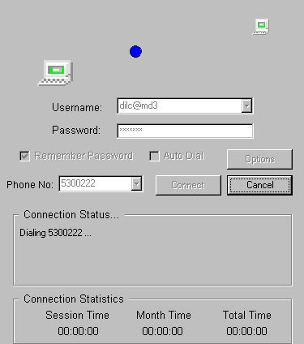



## Dial Net

### Description

The improved Dial Net - Ver 1.1. Over the last app. this newer version has been updated with the necesary user information(dial up status).

It also includes a new feature to play sound whenever a connection is successful. Check it out...

This application illustrates:

1)how to connect to the internet using RAS (Remote Access Service).

2)how to optimize an internet connection.

3)how to detect an internet connection.

4)how to automatically disconnect an internet connection

5)how to identify valuable internet information.

6)how to use encryption routinues

7)how to maintain internet time.

8)how to play sound files using API function calls.

9)how to use API to show the open file dialog.

Check the code...
 
### More Info
 

             |
---                |---
**Submitted On**   |2001-01-27 12:58:48
**By**             |[Harish Sethuraman](https://github.com/Planet-Source-Code/PSCIndex/blob/master/ByAuthor/harish-sethuraman.md)
**Level**          |Intermediate
**User Rating**    |4.6 (46 globes from 10 users)
**Compatibility**  |VB 4\.0 \(32\-bit\), VB 5\.0, VB 6\.0
**Category**       |[Encryption](https://github.com/Planet-Source-Code/PSCIndex/blob/master/ByCategory/encryption__1-48.md)
**World**          |[Visual Basic](https://github.com/Planet-Source-Code/PSCIndex/blob/master/ByWorld/visual-basic.md)
**Archive File**   |[CODE\_UPLOAD142151272001\.zip](https://github.com/Planet-Source-Code/harish-sethuraman-dial-net__1-14593/archive/master.zip)

